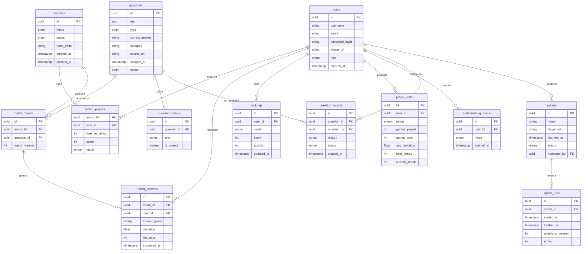

# Esquema de Base de Datos

En este documento se presenta el esquema de la base de datos para el sistema de preguntas y respuestas. El esquema está diseñado para soportar funcionalidades como gestión de usuarios, preguntas, partidas, rankings, estadísticas y reportes. A continuación se muestra el diagrama entidad-relación que representa las tablas principales y sus relaciones:

Por si no se visualiza bien, tambien se presentan las imágenes del esquema:

[Esquema de Base de Datos](img/scheme-black.svg)

[Esquema de Base de Datos](img/scheme.svg)

[Esquema de Base de Datos](img/scheme-white.svg)